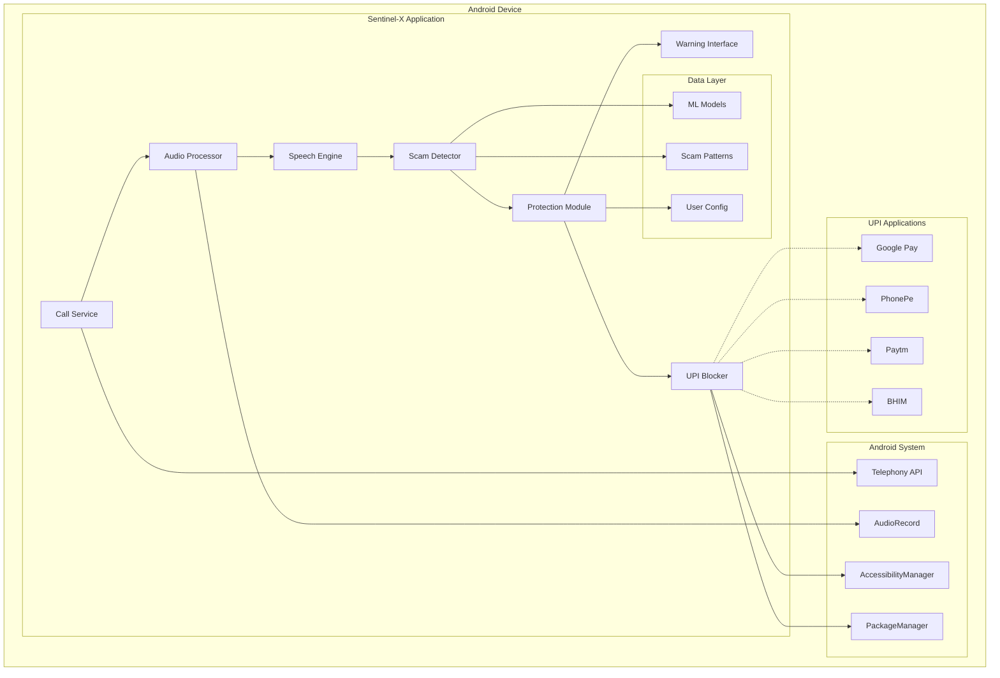
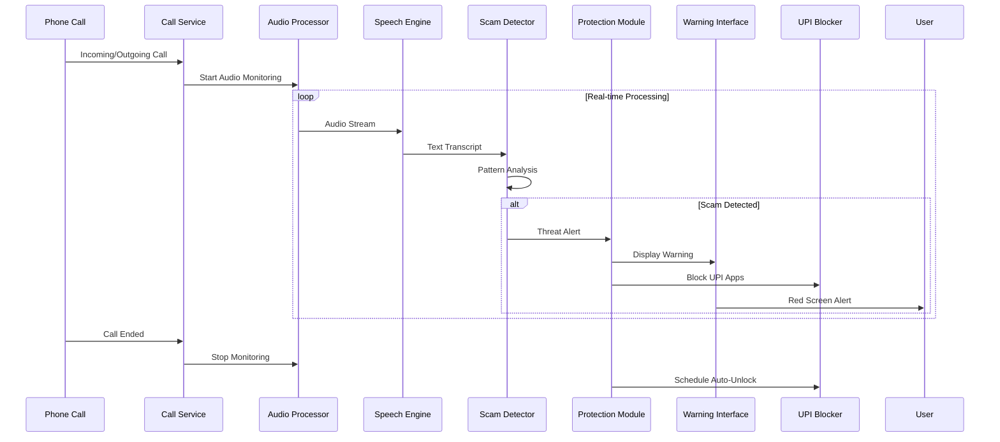

# Design Document: Sentinel-X

## Overview

Sentinel-X is an AI-powered kill switch system designed to protect Android users from digital arrest scams in India. The system operates as a background service that continuously monitors phone calls for scam patterns, providing immediate protection through visual warnings and temporary UPI application blocking.

The architecture prioritizes privacy through on-device processing, real-time performance for immediate threat response, and accessibility for elderly users who are primary targets of these scams. The system uses a multi-layered detection approach combining speech recognition, natural language processing, and behavioral pattern analysis to identify fraudulent calls with high accuracy while minimizing false positives.

Key design principles include:
- **Privacy-First**: All processing occurs on-device with no data transmission
- **Real-Time Response**: Sub-3-second detection and protection activation
- **Offline Operation**: Full functionality without internet connectivity
- **User Safety**: Aggressive protection with clear recovery mechanisms
- **Accessibility**: Simple interfaces optimized for elderly users

## Architecture

### System Architecture



### Component Interaction Flow



## Components and Interfaces

### Call Service Component

**Responsibilities:**
- Monitor phone call state changes
- Manage audio processing lifecycle
- Handle call metadata and context

**Key Interfaces:**
```java
interface CallService {
    void startCallMonitoring(CallContext context);
    void stopCallMonitoring();
    CallState getCurrentCallState();
    void registerCallStateListener(CallStateListener listener);
}

class CallContext {
    String phoneNumber;
    CallDirection direction;
    long startTime;
    CallType type; // VOICE, VIDEO
}
```

### Audio Processor Component

**Responsibilities:**
- Capture real-time call audio from both parties
- Handle audio buffering and streaming
- Manage audio quality and noise reduction

**Technical Implementation:**
- Uses Android AudioRecord API with VOICE_CALL audio source
- Implements circular buffer for continuous audio streaming
- Applies noise reduction and audio enhancement filters
- Maintains 16kHz sample rate for optimal speech recognition

**Key Interfaces:**
```java
interface AudioProcessor {
    void startAudioCapture(AudioConfig config);
    void stopAudioCapture();
    void setAudioStreamListener(AudioStreamListener listener);
    AudioQuality getCurrentAudioQuality();
}

class AudioConfig {
    int sampleRate = 16000;
    int channelConfig = AudioFormat.CHANNEL_IN_MONO;
    int audioFormat = AudioFormat.ENCODING_PCM_16BIT;
    int bufferSize = 4096;
}
```

### Speech Engine Component

**Responsibilities:**
- Convert audio streams to text transcripts
- Support Hindi, English, and mixed language recognition
- Operate entirely offline using on-device models

**Technical Implementation:**
- Integrates TensorFlow Lite speech recognition models
- Uses Whisper-based architecture optimized for mobile devices
- Implements streaming recognition for real-time processing
- Supports code-switching between Hindi and English

**Key Interfaces:**
```java
interface SpeechEngine {
    void startRecognition(AudioStream stream);
    void stopRecognition();
    void setRecognitionListener(RecognitionListener listener);
    void setLanguageModel(LanguageModel model);
}

interface RecognitionListener {
    void onPartialResult(String partialText);
    void onFinalResult(String finalText, float confidence);
    void onError(RecognitionError error);
}
```

### Scam Detector Component

**Responsibilities:**
- Analyze conversation transcripts for scam patterns
- Detect authority impersonation and coercive language
- Calculate threat scores and trigger protection

**Detection Algorithms:**
1. **Keyword Pattern Matching**: Identifies law enforcement terminology, urgency indicators, and payment demands
2. **Linguistic Analysis**: Detects coercive language patterns and psychological manipulation tactics
3. **Conversation Flow Analysis**: Monitors rapid escalation from authority claims to payment requests
4. **Behavioral Pattern Recognition**: Identifies typical digital arrest scam conversation structures

**Key Scam Indicators:**
- Authority impersonation keywords: "CBI", "police", "arrest", "investigation"
- Urgency language: "immediately", "right now", "within minutes"
- Payment demands: "transfer money", "UPI", "account details"
- Threat language: "arrest warrant", "legal action", "court case"
- Secrecy demands: "don't tell anyone", "confidential matter"

**Key Interfaces:**
```java
interface ScamDetector {
    ThreatAssessment analyzeConversation(ConversationContext context);
    void updateScamPatterns(ScamPatternDatabase patterns);
    DetectionConfig getDetectionConfig();
    void setDetectionSensitivity(SensitivityLevel level);
}

class ThreatAssessment {
    float threatScore; // 0.0 to 1.0
    List<ScamIndicator> detectedIndicators;
    ThreatLevel level; // LOW, MEDIUM, HIGH, CRITICAL
    String explanation;
}
```

### Protection Module Component

**Responsibilities:**
- Coordinate threat response actions
- Manage warning display and UPI blocking
- Handle user interactions during protection mode

**Protection Strategies:**
- **Immediate Response**: Activate within 1 second of threat detection
- **Graduated Response**: Scale protection based on threat level
- **User Override**: Provide secure bypass mechanisms for false positives
- **Auto-Recovery**: Automatically restore normal operation after threat passes

**Key Interfaces:**
```java
interface ProtectionModule {
    void activateProtection(ThreatAssessment threat);
    void deactivateProtection();
    ProtectionStatus getProtectionStatus();
    void handleUserOverride(OverrideRequest request);
}

class ProtectionStatus {
    boolean isActive;
    ThreatLevel currentThreatLevel;
    long activationTime;
    List<ProtectionAction> activeActions;
}
```

### Warning Interface Component

**Responsibilities:**
- Display full-screen threat warnings
- Provide clear, accessible user guidance
- Support multiple languages and accessibility features

**Design Principles:**
- **High Contrast**: Red background with white text for maximum visibility
- **Large Text**: Minimum 24sp font size for elderly users
- **Simple Language**: Avoid technical jargon, use clear warnings
- **Single Action**: One primary action button to reduce confusion
- **Persistent Display**: Cannot be easily dismissed during active threats

**Key Interfaces:**
```java
interface WarningInterface {
    void displayThreatWarning(ThreatWarning warning);
    void dismissWarning();
    void setAccessibilityMode(AccessibilityConfig config);
    void setLanguage(Language language);
}

class ThreatWarning {
    String title;
    String message;
    ThreatLevel severity;
    List<UserAction> availableActions;
    boolean allowDismissal;
}
```

### UPI Blocker Component

**Responsibilities:**
- Uses Android accessibility services with user-granted permissions to temporarily restrict high-risk transaction flows
- Intercept app launch attempts during protection mode through legitimate Android APIs
- Provide secure override mechanisms for legitimate payments

**Technical Implementation:**
- **AccessibilityService Integration**: Leverages Android's AccessibilityService API with explicit user permission to monitor app launches
- **Overlay Mechanism**: Creates system-level overlays (TYPE_APPLICATION_OVERLAY) that appear over UPI apps during threat periods
- **Intent Interception**: Uses PackageManager and ActivityManager APIs to detect UPI app launch attempts
- **Whitelist Management**: Maintains user-configurable list of UPI applications (Google Pay, PhonePe, Paytm, BHIM, etc.)
- **Permission Scope**: Operates within standard Android permission model - requires SYSTEM_ALERT_WINDOW and accessibility permissions
- **User Control**: All blocking actions require explicit user consent and can be immediately overridden

**Legal and Technical Boundaries:**
- **No OS Modification**: Does not modify Android system files or require root access
- **User Permission Based**: All functionality operates within user-granted permissions
- **Reversible Actions**: All blocking is temporary and user-controllable
- **No Data Access**: Does not access UPI app data, only monitors launch events
- **Compliance**: Adheres to Google Play Store policies and Android security model

**Key Interfaces:**
```java
interface UPIBlocker {
    void blockUPIApplications();
    void unblockUPIApplications();
    void addUPIApplication(String packageName);
    BlockingStatus getBlockingStatus();
    void handleEmergencyOverride(EmergencyOverride override);
}

class BlockingStatus {
    boolean isBlocking;
    List<String> blockedApplications;
    long blockStartTime;
    OverrideMethod availableOverrides;
}
```

## Known Technical Risks and Mitigations

### Real-Time Audio Processing Risks

**Risk**: Audio processing latency exceeding acceptable thresholds during high CPU load
- **Target**: <500ms detection latency under normal conditions, <1000ms under stress
- **Mitigation**: Implement adaptive audio buffer sizing and priority thread scheduling
- **Fallback**: Reduce audio quality temporarily while maintaining core detection capability
- **Monitoring**: Real-time latency tracking with automatic performance adjustments

**Risk**: Audio capture failure on specific Android versions or device manufacturers
- **Target**: 95% compatibility across Android 8.0+ devices
- **Mitigation**: Device-specific audio source fallbacks (VOICE_CALL → MIC → VOICE_RECOGNITION)
- **Fallback**: Text-based scam detection using call metadata and user-reported keywords
- **Testing**: Comprehensive device compatibility matrix validation

### Speech Recognition Accuracy Risks

**Risk**: Poor recognition accuracy in noisy environments or with accented speech
- **Target**: >85% accuracy in clear conditions, >70% in noisy environments
- **Mitigation**: Multi-model ensemble with noise-robust preprocessing
- **Fallback**: Keyword-based detection when confidence drops below 60%
- **Adaptation**: User-specific accent adaptation through optional calibration

**Risk**: Model size constraints affecting recognition quality
- **Target**: <75MB total model footprint while maintaining accuracy
- **Mitigation**: Quantized models with dynamic loading of language-specific components
- **Fallback**: Cloud-based recognition with explicit user consent for critical calls
- **Optimization**: Progressive model pruning based on usage patterns

### False Positive Management

**Risk**: Legitimate authority calls being blocked (police reporting crimes, etc.)
- **Target**: <2% false positive rate for legitimate authority interactions
- **Mitigation**: Context-aware detection considering call duration, number verification, and conversation flow
- **Fallback**: 30-second delayed blocking with clear override options
- **Learning**: User feedback integration to improve detection accuracy

**Risk**: Business calls with payment discussions triggering false alarms
- **Target**: <5% false positive rate for legitimate business transactions
- **Mitigation**: Caller ID verification, business number whitelist, and conversation context analysis
- **Fallback**: Graduated response system with warnings before blocking
- **Configuration**: User-adjustable sensitivity levels with clear trade-off explanations

### Battery and Performance Impact

**Risk**: Continuous audio processing draining battery excessively
- **Target**: <5% additional battery drain during normal usage
- **Mitigation**: Intelligent processing activation only during active calls
- **Optimization**: CPU governor integration and thermal throttling awareness
- **Monitoring**: Real-time power consumption tracking with user notifications

**Risk**: Memory usage causing device instability or app crashes
- **Target**: <200MB peak memory usage, <100MB steady state
- **Mitigation**: Streaming audio processing with circular buffers
- **Cleanup**: Aggressive garbage collection and temporary data purging
- **Fallback**: Reduced feature set on low-memory devices

### Android System Integration Risks

**Risk**: AccessibilityService permissions being revoked or restricted
- **Target**: Maintain blocking capability across Android version updates
- **Mitigation**: Multiple blocking mechanisms (overlay, intent interception, notification blocking)
- **Fallback**: User notification system when technical blocking fails
- **Compliance**: Regular Android policy compliance reviews and updates

**Risk**: UPI app updates bypassing blocking mechanisms
- **Target**: <24 hour response time to blocking bypass discoveries
- **Mitigation**: Dynamic app signature monitoring and behavior analysis
- **Updates**: Automated pattern updates through secure channels
- **Community**: Crowdsourced bypass detection and reporting system

## Data Models

### Core Data Structures

```java
// Conversation tracking
class ConversationContext {
    String callId;
    String phoneNumber;
    long startTime;
    List<ConversationSegment> segments;
    CallDirection direction;
    CallState currentState;
}

class ConversationSegment {
    String speaker; // "CALLER" or "RECIPIENT"
    String text;
    long timestamp;
    float confidence;
    List<ScamIndicator> indicators;
}

// Scam detection models
class ScamIndicator {
    IndicatorType type;
    String matchedText;
    float confidence;
    String explanation;
    SeverityLevel severity;
}

enum IndicatorType {
    AUTHORITY_IMPERSONATION,
    URGENCY_LANGUAGE,
    PAYMENT_DEMAND,
    THREAT_LANGUAGE,
    SECRECY_DEMAND,
    COERCIVE_PATTERN
}

// User configuration
class UserConfiguration {
    SensitivityLevel detectionSensitivity;
    Language preferredLanguage;
    AccessibilitySettings accessibility;
    NotificationPreferences notifications;
    List<String> trustedNumbers;
    boolean emergencyOverrideEnabled;
}

// Incident logging
class SecurityIncident {
    String incidentId;
    long timestamp;
    String phoneNumber;
    ThreatAssessment threat;
    List<ProtectionAction> actionsToken;
    IncidentOutcome outcome;
    boolean userReported;
}
```

### Machine Learning Models

**Speech Recognition Model:**
- **Architecture**: Whisper-based transformer optimized for mobile
- **Languages**: Hindi, English, mixed code-switching
- **Model Size**: ~50MB compressed TensorFlow Lite model
- **Accuracy**: >85% for clear audio, >75% for noisy conditions
- **Latency**: <2 seconds for 10-second audio segments

**Scam Detection Model:**
- **Architecture**: BERT-based text classifier with custom fraud detection layers
- **Training Data**: Synthetic scam conversations, reported incident transcripts
- **Model Size**: ~25MB compressed TensorFlow Lite model
- **Accuracy**: >95% precision, >90% recall on validation set
- **Features**: Keyword matching, linguistic patterns, conversation flow analysis

**Pattern Database:**
- **Scam Scripts**: Common digital arrest scam conversation templates
- **Authority Keywords**: Law enforcement terminology in Hindi and English
- **Coercive Phrases**: Psychological manipulation language patterns
- **Payment Indicators**: UPI, banking, and financial transaction keywords
- **Update Mechanism**: Periodic model updates through secure channels